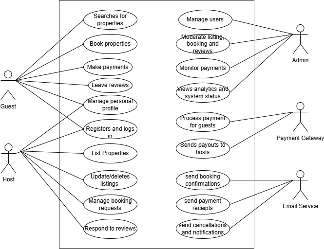

# Use Case Diagram

This directory contains the use case diagram for the **ALX Airbnb Backend Project**.

## 📌 Overview

The use case diagram visualizes the key interactions between different user roles (Guest, Host, Admin) and the backend system. It includes essential functionalities such as:

- User Registration and Login
- Property Management (by Hosts)
- Property Search and Booking (by Guests)
- Payment Processing (via Payment Gateway)
- Review and Rating System
- Admin Management Operations

## 🧑‍🤝‍🧑 Actors

- **Guest**: Can search, book, and review properties.
- **Host**: Can list, manage, and respond to bookings.
- **Admin**: Oversees the platform, users, and content.
- **Payment Gateway**: Handles payment processing.
- **Email Service**: Sends notifications and confirmations.

## 🖼️ Diagram

